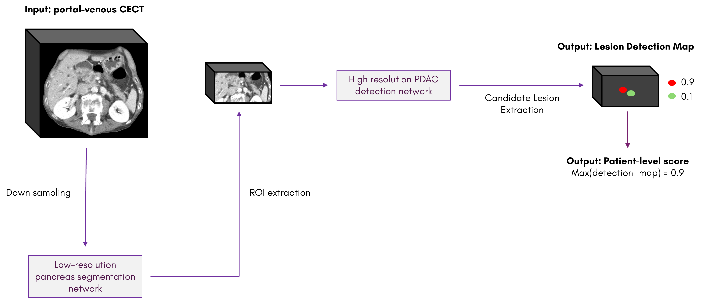

# [PANORAMA](https://panorama.grand-challenge.org/) Challenge Project

This repository is a fork of [the repository that was used for the baseline model](https://github.com/DIAGNijmegen/nnUNetv2_checkpoints). Additionally, the pipeline is based on what was provided in the [baseline repository](https://github.com/DIAGNijmegen/PANORAMA_baseline).

The general process and set-up of the pipeline is the same as the one shown in the baseline model's repository, illustrated below:



The model consists of two tasks, a pancreas segmentation step and a PDAC detection step. After acquiring the datasets of images and labels from the [Grand Challenge page](https://panorama.grand-challenge.org/datasets-imaging-labels/) and structuring the directories according to the nnU-Net format, the first step is to resample all images to a voxel spacing of [4.5, 4.5, 9.0] mm using the resample_img() function from the baseline repository. Then, the command `nnUNetv2_plan_and_preprocess -d 113 --verify_dataset_integrity` can be used for planning (i.e. determining image sizes, modalities) and preprocessing. Finally, the model can be trained with the commands:
```
nnUNetv2_train -d 113 0 3d_fullres --c
nnUNetv2_train -d 113 1 3d_fullres --c
nnUNetv2_train -d 113 2 3d_fullres --c
nnUNetv2_train -d 113 3 3d_fullres --c
nnUNetv2_train -d 113 4 3d_fullres --c
```
These commands will train task 113 (113 is the dataset ID chosen for the pancreas segmentation task, but can be anything).

The second part of the pipeline is the PDAC detection model. As an initial step, the custom CropPancreasRoi() function from the baseline repository is used to crop all images to the region of interest: the pancreas. Furthermore, the custom [nnunetv2/training/nnUNettrainer/customTrainerCEcheckpoints.py](customTrainerCEcheckpoints.py) file from the baseline repository is copied into the nnU-Net trainer folder. All other dependencies can be installed by changing directory to this repository's folder locally, then running `pip install -e .`. Again, the preprocessing command is run for this task: `nnUNetv2_plan_and_preprocess -d 114 --verify_dataset-integrity`. Finally, this model can also be trained with similar commands:
```
nnUNetv2_train -d 114 0 -tr nnUNetTrainer_Loss_CE_checkpoints 3d_fullres --c
nnUNetv2_train -d 114 1 -tr nnUNetTrainer_Loss_CE_checkpoints 3d_fullres --c
nnUNetv2_train -d 114 2 -tr nnUNetTrainer_Loss_CE_checkpoints 3d_fullres --c
nnUNetv2_train -d 114 3 -tr nnUNetTrainer_Loss_CE_checkpoints 3d_fullres --c
nnUNetv2_train -d 114 4 -tr nnUNetTrainer_Loss_CE_checkpoints 3d_fullres --c
```
After all checkpoints for each fold have been generated, they are ensembled using the [Select_Best_Checkpoint_Training.ipynb](https://github.com/DIAGNijmegen/PANORAMA_baseline/blob/main/checkpoint_selection/Select_Best_Checkpoint_Training.ipynb) notebook from the baseline repository, which generates the final detection map.

Our contributions to the code are indicated by the use of comment in the code itself. To provide some guidance, our contributions appear in the following files:
- ./nnUNetv2_checkpoints/nnunetv2/training/nnUNetTrainer**/nnUNetTrainer.py**
- ./nnUNetv2_checkpoints/nnunetv2/training/lr_scheduler/**scheduler.py**
- ./nnUNetv2_checkpoints/nnunetv2/training/loss/**focal_loss.py**
- ./nnUNetv2_checkpoints/nnunetv2/training/loss/**compound_losses.py
**
